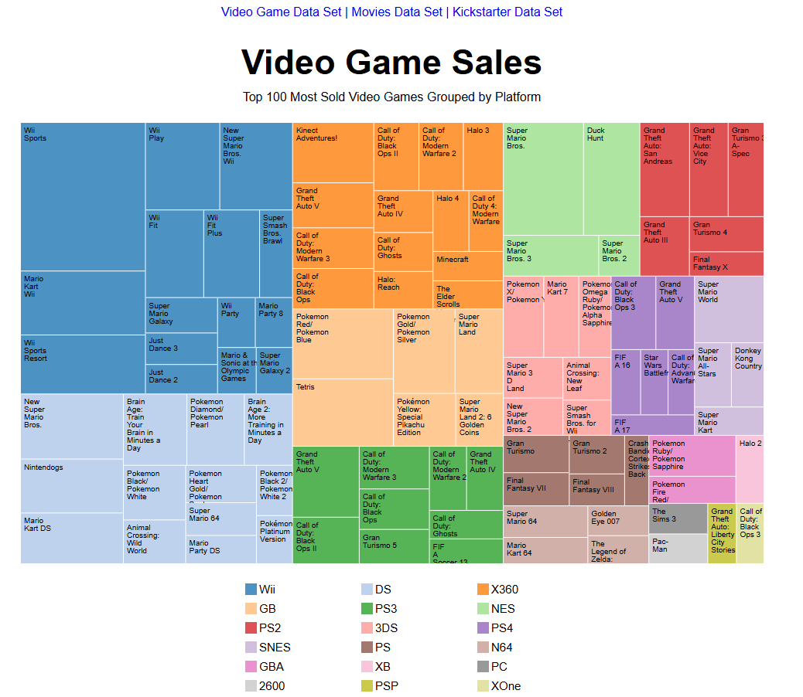
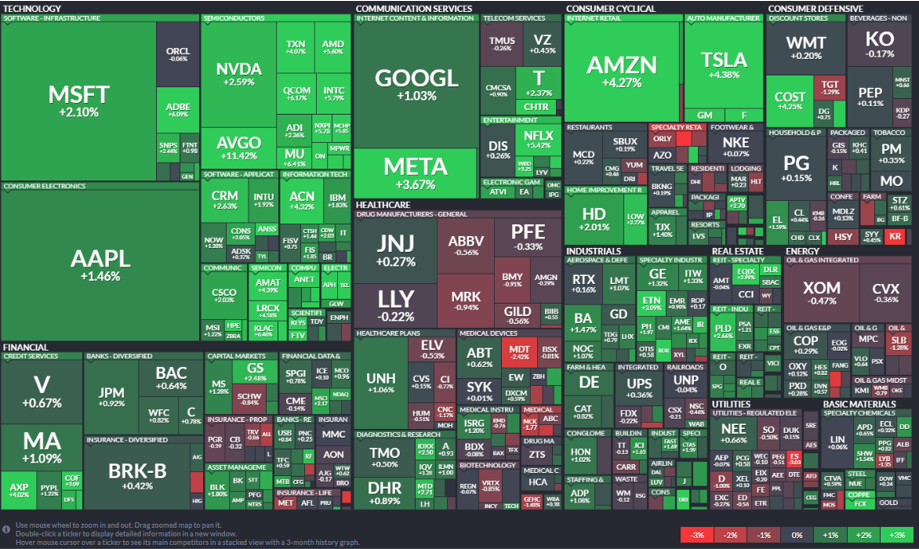

# Tree Map Visualization

## Overview

This project implements an interactive **Tree Map** visualization using **D3.js**, a JavaScript library for creating dynamic, interactive data visualizations in web browsers. The Tree Map visualizes hierarchical datasets, allowing users to explore data through color-coded rectangles, where the area of each rectangle corresponds to a data value.

### Featured Datasets:

- **Video Game Sales**: Top 100 Most Sold Video Games Grouped by Platform.
- **Movie Sales**: Top 100 Highest Grossing Movies Grouped by Genre.
- **Kickstarter Pledges**: Top 100 Most Pledged Kickstarter Campaigns Grouped by Category.

### Goal:
The goal of this project is to build a **Tree Map** that dynamically displays hierarchical data with color-coded categories. Users can hover over individual blocks (representing items) to see detailed information, such as the item name, category, and value. 

## Potential Applications in Financial Markets

The **Tree Map** visualization can have significant applications in the financial markets, helping analysts, investors, and traders make informed decisions. Here are a few examples:

### 1. **Market Sector Analysis**
   - In the financial markets, different stocks and assets belong to various sectors, such as technology, energy, finance, etc. A Tree Map can help visualize the relative size of these sectors in terms of market capitalization, revenue, or stock performance. By grouping companies by sector, a user can quickly assess which sectors are performing well, and which ones are underperforming.

### 2. **Portfolio Management**
   - A Tree Map can be used to represent an investment portfolio, where each rectangle represents an individual asset or stock. The size of the rectangle could represent the weight of that asset in the portfolio (based on value), and the color can indicate the performance (e.g., green for positive performance, red for negative). This allows portfolio managers to visually track the diversification of their portfolios and see how their investments are distributed across different asset classes.

### 3. **Market Capitalization Analysis**
   - A Tree Map can visualize the market cap of different financial instruments (stocks, commodities, cryptocurrencies) in a single view. This visualization can be used to track how different companies or commodities are contributing to the overall market. Larger rectangles will represent assets with larger market caps, while smaller rectangles will represent those with smaller caps.

### 4. **Volatility Analysis**
   - Investors can use a Tree Map to visualize volatility across different market segments. Each block can represent a stock or a sector, with the size proportional to its trading volume or market cap, and the color representing price volatility. High volatility might be shown in red, while stable assets might be green. This helps identify riskier areas of the market at a glance.

### 5. **Risk Assessment**
   - In financial markets, risk management is key. A Tree Map can be used to visualize the risk level of various assets or portfolios. The rectangles can represent the assets, and their color or size could reflect factors such as risk-adjusted returns, beta, or other key risk metrics.

### 6. **Crypto Market**
   - Tree Maps are an excellent way to visualize the relative size and performance of cryptocurrencies within the larger market. Each cryptocurrency can be represented as a rectangle, with the size reflecting market cap, and color showing price change. This helps crypto investors quickly see which cryptocurrencies are trending upwards and which are losing value.

## Features

- **Interactive Tree Map**: Rectangular blocks representing each item (e.g., stocks, sectors, or assets) with areas proportional to their values.
- **Tooltips**: Hovering over any block displays detailed information about the item, including:
  - **Name**
  - **Category**
  - **Value**
- **Color-Coded Blocks**: Each category of data is color-coded to make it visually easier to differentiate between different groups.
- **Legend**: A dynamic legend is displayed to map each color to its corresponding category.
  
## Technologies Used

- **D3.js**: A JavaScript library for producing dynamic, interactive data visualizations in web browsers.
- **HTML/CSS**: For structuring and styling the webpage.
- **JavaScript**: For implementing the logic to fetch and parse data, create the Tree Map layout, and handle interactivity.

## Data

The datasets contain hierarchical data, with each item having the following attributes:
- **Name**: The name of the item (e.g., stock, sector, cryptocurrency).
- **Category**: The category to which the item belongs (e.g., sector, asset type, market).
- **Value**: A numeric value representing the size of the item (e.g., market cap, trading volume, price change).

